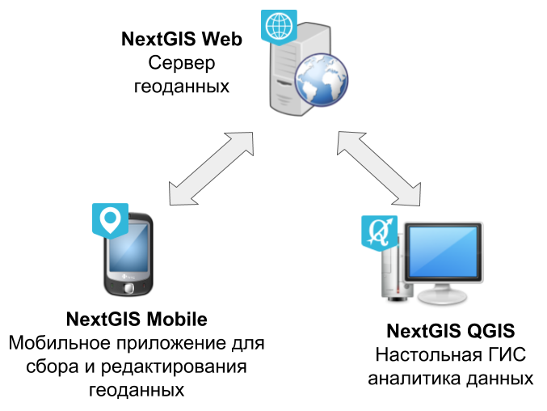

.. sectionauthor:: Дмитрий Барышников <dmitry.baryshnikov@nextgis.ru>

.. _ngcourse_stack_basic:

Программное обеспечение NextGIS
==================================

Стэк NextGIS включает в себя следующие основные компоненты:

* NextGIS Web
* NextGIS QGIS
* NextGIS Mobile

   Основные компоненты ПО NextGIS.

**NextGIS Web** - это серверная :term:`геоинформационная система` (:abbr:`ГИС
(геоинформационная система)`), которая предоставляет возможность хранения и
редактирования геоданных, просмотра в веб-браузере карт. Кроме того, NextGIS Web
может обмениваться :term:`геоданными <геоданные>` с другими продуктами NextGIS.

NextGIS Web обеспечивает следующие возможности:

* Просмотр в веб-браузере карт (карт может быть много, с разным составом слоев и
  оформлением).
* Гибкая настройка прав доступа.
* Геоданные для карт могут получаться из :term:`PostGIS`, либо загружаются из
  файловых ГИС форматов :term:`ESRI Shape`,
  :term:`GeoJSON` или :term:`GeoTIFF`
* Векторные данные можно скачивать в виде файлов в форматах :term:`GeoJSON`,
  :term:`CSV`, :term:`ESRI Shape`.
* Картостили могут импортироваться из проекта :term:`QGIS` или настраиваться вручную.
* Может работать как сервер :term:`TMS`, :term:`WMS`, :term:`WFS`.
* Может работать как клиент :term:`WMS`.
* Пользователь может :ref:`добавлять фотографии к записям <ngw_add_photos>`,
  :ref:`изменять атрибуты записей <ngw_attributes-edit>`, :ref:`поддерживается
  протокол WFS-T для редактирования <ngw_wfs_service>`.

**NextGIS QGIS** - это полнофункциональная настольная ГИС
основанная на QGIS, предназначена  для создания, управления, редактирования и
анализа данных, производства карт и атласов,
выполнения аналитических операций, публикация карт в сети Интернет.

**NextGIS Mobile** - это мобильная ГИС для операционной системы :term:`Android`.

NextGIS Mobile позволяет:

* отображать карту в виде набора слоев;
* выполнять навигацию по карте (увеличение, уменьшение, перемещение);
* добавлять векторные данные из формата GeoJSON;
* добавлять растровые данные в виде тайлового кэша;
* подключать онлайн источник тайлов (XYZ и TMS);
* подключать растровые и векторные слои из
  `nextgis.com <https://my.nextgis.com/signup/?next=/webgis/>`_
  и `NextGIS Web <http://nextgis.ru/nextgis-web/>`_;
* создавать и модифицировать векторные геоданные (геометрии и атрибуты);
* просматривать атрибуты выбранной геометрии через диалог идентификации;
* модифицировать атрибуты векторного слоя при помощи настраиваемых форм ввода;
* делиться векторными геоданными с использованием стандартных инструментов Android;
* записывать треки и управлять их отображением, а также удалять выбранные треки
  или все треки;
* отображать координаты, скорость, высоту устройства на карте, источник
  географических координат, количество спутников, используемых для фиксирования
  местоположения (в случае :term:`GPS`);
* накапливать и передавать в фоновом режиме по сети Интернет (при наличии подключения)
  в `nextgis.com <https://my.nextgis.com/signup/?next=/webgis/>`_ или
  `NextGIS Web <http://nextgis.ru/nextgis-web/>`_ созданные и/или измененные
  геоданные из векторных слоев.
