.. sectionauthor:: Дмитрий Барышников <dmitry.baryshnikov@nextgis.ru>

.. _ngcource_basic_op:

Предварительная обработка
=========================

Общие сведения
--------------

Космические аппараты ДДЗ могут работать в разных диапазонах электромагнитных волн.
Сейчас на орбите присутствует множество :abbr:`КА (космических аппаратов)`, которые
работают в видимом, инфракрасном и радио диапазонах. На одном КА может быть 
установлено оборудования для работы в различных диапазонах.

Материалы в видимом и :abbr:`ИК (инфракрасном)` диапазонах представляют собой 
изображение в цифровой форме или на фотопленке. Материалы с радарных спутников
представляют собой сигнал (радио голограмма), из которого может извлекаться как
информация для формирования изображения, так и данные о высоте (рельефе).

В зависимости от качества получаемого изображения (размер ячейки растра, проекция 
пиксела на местности и т.п.) КА классифицируют на:
    
    * КА низкого разрешения (выше 10 м),
    * КА среднего разрешения (от 10 до 2 м),
    * КА высокого разрешения (от 2 до 1 м),
    * КА сверхвысокого разрешения (лучше 1 м).

К КА низкого разрешения можно отнести **Landsat**, **IRS**, **Aster**, среднего разрешения -
**Spot**, **RapidEye**, высокого **Ресурс-ДК** (хотя он уже переместился в среднее), **Ресурс-П**,
**EROS-A1**, **Formosat**, сверхвысокого - **GeoEye**, **WorldView**.

Обычно снимки поставляются в формате GeoTIF (реже в JP2 и HDF). Снимок сопровождается
метаданными, где дается описание даты и времени съемки, условий съемки (облачность,
освещенность), характеристики орбиты, RPC коэффициенты и другая полезная информация.

При сканировании фотоматериалов часто метаданные и привязка недоступны, и такие
снимки необходимо привязывать самостоятельно по карте или другому, привязанному
снимку. 

.. _ngcource_basic_op1:
    
Получение ДДЗ из сервиса EarthExplorer
--------------------------------------

Для отработки предварительной обработки снимков необходимо скачать две разновременные
сцены с КА Landsat 8.

Для этого необходимо выполнить вход в сервис EarthExplorer,
расположенный по адресу: http://earthexplorer.usgs.gov/ (см. :numref:`ngcourse_earth_explorer1_pic`).

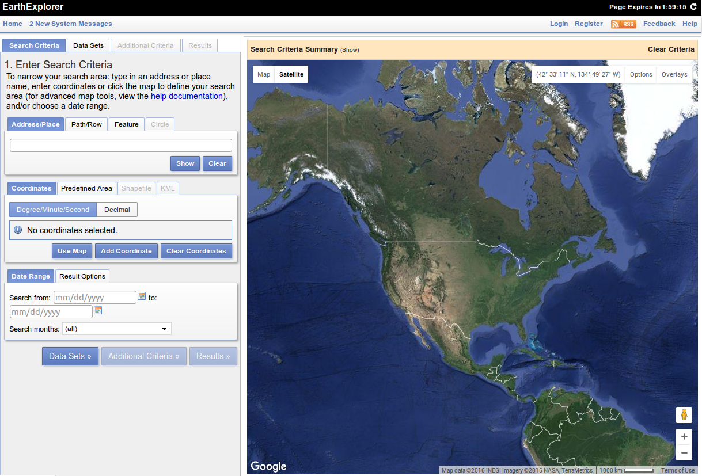
   
   Главная страница сервиса EarthExplorer.

Далее необходимо задать область интереса (см. :numref:`ngcourse_earth_explorer2_pic`), 
а также, при необходимости, диапазон дат и сезонность.

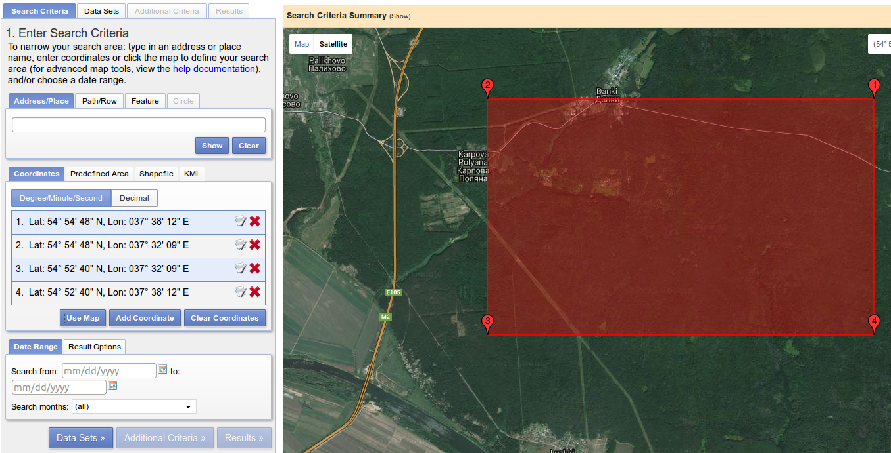
   
   Первый шаг мастера получения ДДЗ (Search criteria).

Далее необходимо выбрать КА для получения материалов (см. :numref:`ngcourse_earth_explorer3_pic`), 
а также, при необходимости, ограничения по облачности и др. параметрам (в зависимости
от типа КА).

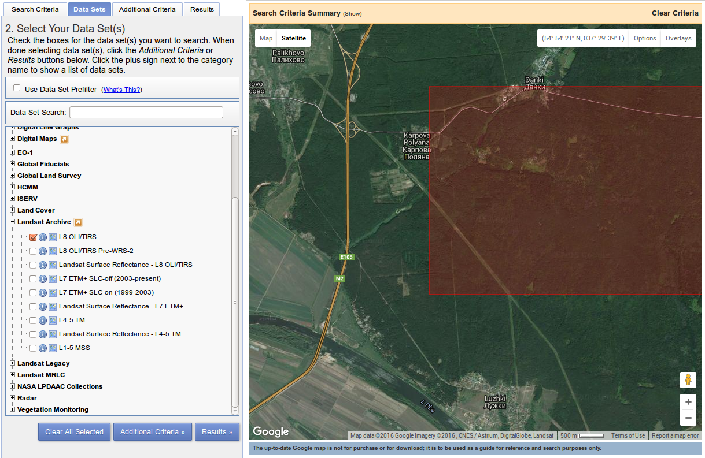
   
   Второй шаг мастера получения ДДЗ (Data Sets).

Выбираем: :menuselection:`Landsat Archive --> L8 OLI/TIRS`.

Далее переходим к выбору дополнительных критериев (см. :numref:`ngcourse_earth_explorer4_pic`), 
где указываем, что нам необходимы снимки с не более чем 10% облачности.

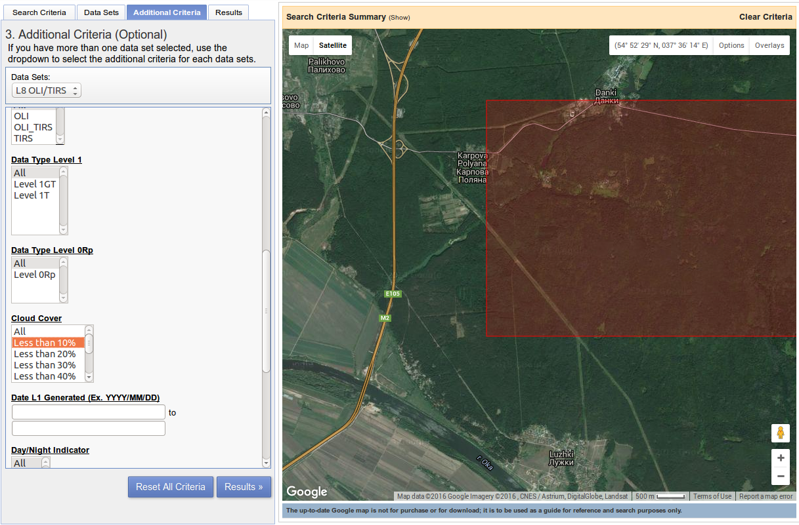
   
   Третий шаг мастера получения ДДЗ (Additional critera).

В заключение нажимаем на кнопку "Results". Сервис выполнит поиск снимков по нашим 
критериям. Результат работы сервиса представлен на :numref:`ngcourse_earth_explorer5_pic`.

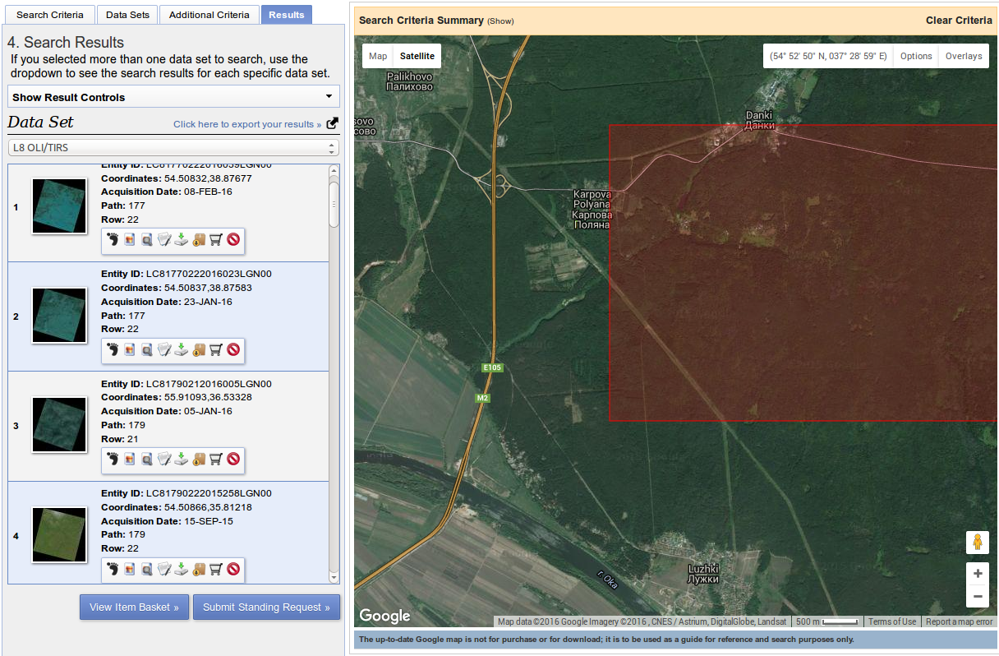
   
   Результаты поиска ДДЗ.

У каждой сцены имеется панель операций:
    
    * посмотреть проекцию сцены на местности,
    * просмотреть разреженное изображение сцены (preview),
    * посмотреть метаданные сцены,
    * скачать сцену и др.

Для пользователей, не выполнивших вход в программу, часть операций будет недоступна. Выберем 
сцены одного сезона, но с разницей в год и более, и отметим их на скачивание. При этом
будет отображен диалог выбора типа продукта. В зависимости от типа КА выбор может
отличаться. В случае Landsat 8 будет следующий список:
     
     * LandsatLook "Natural Color" Image (7.4 MB),
     * LandsatLook "Thermal" Image (3.0 MB),
     * LandsatLook "Quality" Image (428.7 KB),
     * LandsatLook images with Geographic Reference (10.8 MB),
     * Level 1 GeoTIFF Data Product (862.4 MB). 
     
Необходимо скачать самый большой архив, т.к. в нем содержаться ДДЗ только с 
выполненной предварительной радиометрической и геометрической коррекцией.      

.. _ngcource_basic_op2:
    
Предварительная обработка
-------------------------

Полученные снимки распакуем. 
Запустим :program:`NextGIS QGIS` и вызовем меню :menuselection:`Растр --> Прочее 
--> Информация...`. В открывшемся диалоге выберем первый канал из распакованного 
архив (имя файла оканчивается на B1.TIF), включим режим редактирования поля 
команды (кнопка с карандашом) и добавим сразу после *gdalinfo* ключ **-mdd all**.
Далее нажмем кнопку "ОК". Диалог представлен на :numref:`ngcourse_gdalinfo_pic`.

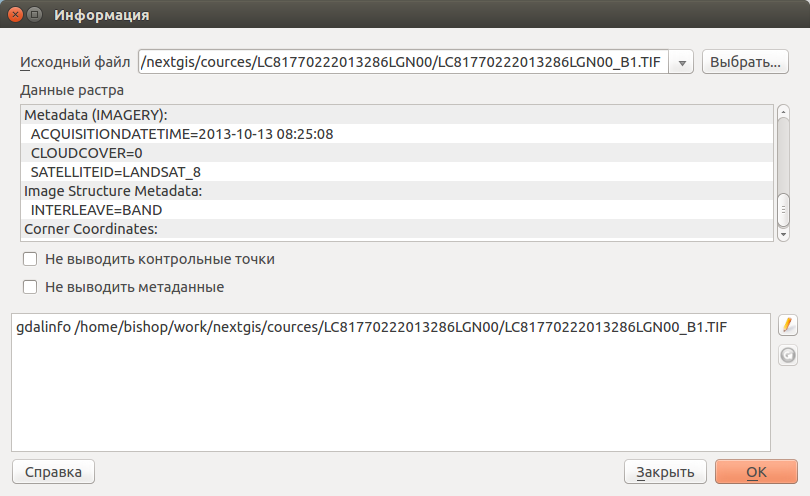
   
   Диалог информации о растре.
     
В верхней части диалога посмотрим текст с описанием растра. Найдем величину 
**pixel size**. Для всех каналов, за исключением 8-го, значение будет составлять 
30 м. Восьмой канал имеет разрешение 15 м. 
 
Выполним объединение каналов в единый растр. Для этого вызовем :menuselection:`Растр
--> Прочее --> Объединение`. В диалоге (см. :numref:`ngcourse_gdalmerge_pic`) 
выберем с 1 по 7 канал. В качестве выходного формата установим GeoTIFF. Поставим 
отметку у пункта "склеить поканально".

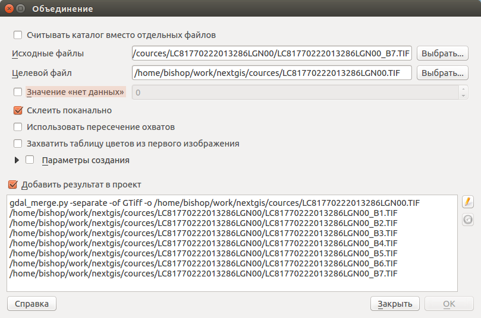
   
   Диалог объединения каналов.

После удачного завершения работы инструмента, новый растр должен быть добавлен на
карту. 

Посмотрим гистограмму полученного растра. Для этого, в дереве слоев вызовем 
контекстное меню растра и выберем пункт "Свойства". В открывшемся диалоге
перейдем на вкладку "Гистограмма" и нажмем "Построить" (см. :numref:`ngcourse_histogram_pic`).

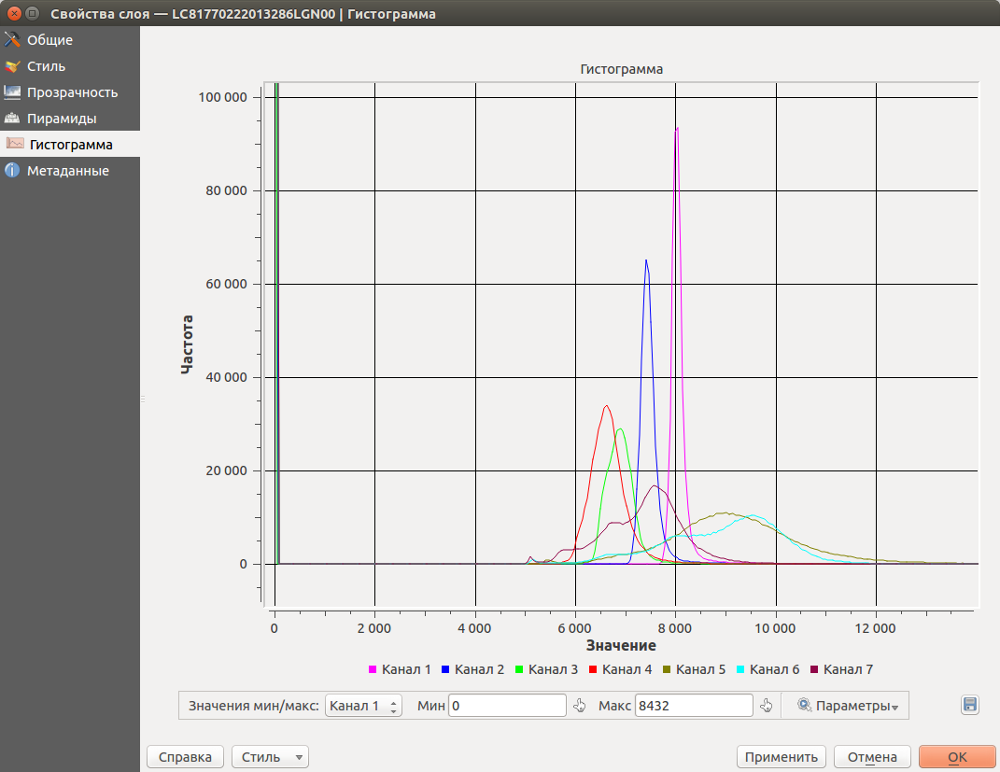
   
   Вкладка "Гистограмма" диалога свойств.
 
На гистограмме можно заметить, что хотя у нас пиксел кодируется типом UInt16, что 
дает диапазон возможных значений от -32768 до 32767, но большинство значений лежит
в более узких пределах. Это говорит о возможности сенсора на КА дискретизировать 
значения входного светового потока меньшим количество разрядов (бит), обычно 11 
или 12.

Установим нашему растру естественные цвета. Для выбора естественных цветов 
используется следующая комбинация каналов: 4,3,2 [#f1]_.
Это значит, что в качестве красного канала, надо выбрать 4-й канал, зеленого - 3 
и синего 2. Настройку комбинации каналов делают на вкладке "Стиль" 
(см. :numref:`ngcourse_raster_style_pic`).

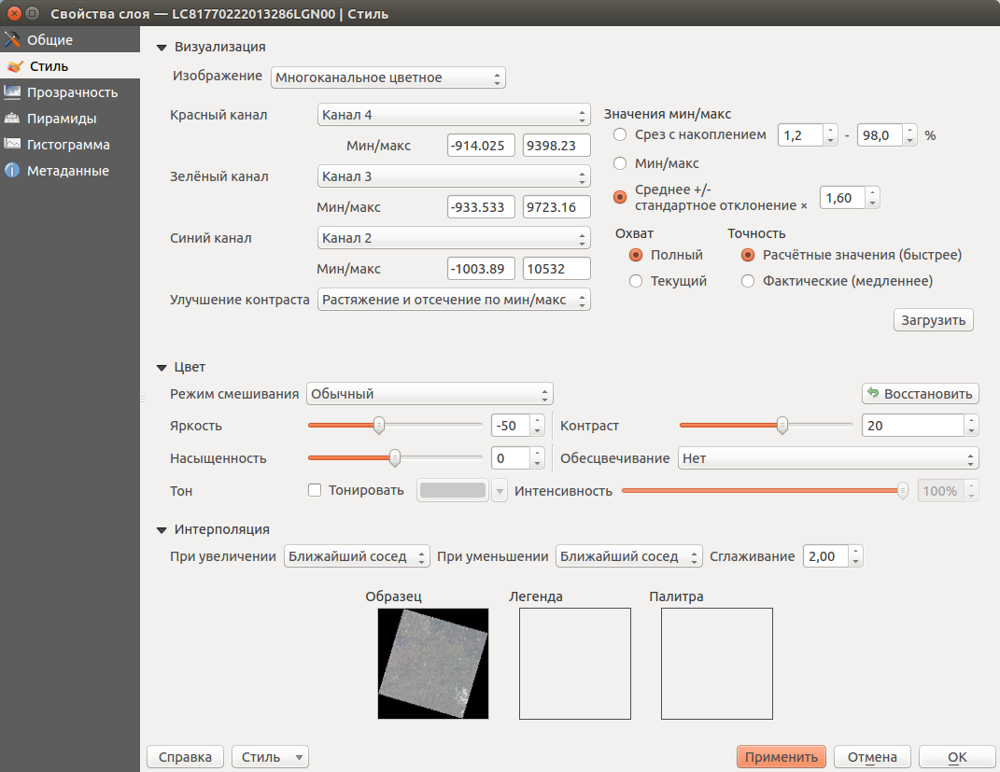
   
   Вкладка "Стиль" диалога свойств.

Дополнительно можно выбрать значение яркости и контраста для придания изображению
естественного вида.

.. _ngcource_basic_op3:
    
Привязка растра
---------------

Для отработки привязки растра нам необходим непривязанный растр. Для получения 
такого растра воспользуемся сервисом EarthExplorer, расположенным по адресу: 
http://earthexplorer.usgs.gov/ . Для этого выполним указания из подраздела :ref:`ngcource_basic_op1`, 
но на втором шаге вместо Landsat необходимо выбрать :menuselection:`Declassified data --> Declass 1`,
а также Declass 2 и Declass 3. [#f2]_  

Далее выполним поиск снимков, которые пересекаются со снимками Landsat 8, которые
будут эталонными данными для привязки. 

Далее в :program:`NextGIS QGIS` выполним :menuselection:`Растр --> Привязка растров
--> Привязка растров...` (данное меню доступно только в случае, если активирован
соответствующий плагин в диалоге управления модулями).

В открывшемся диалоге необходимо выбрать растр, который мы хотим привязать (см.
:numref:`ngcourse_raster_rectiy_pic`).

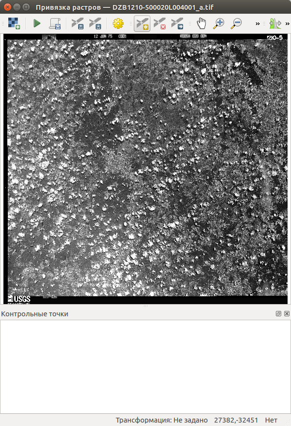
   
   Диалога привязки растров.
 
Далее необходимо указывать соответствующие точки на непривязанном растре и окне
карты. В процессе расстановки точек необходимо следить за ошибкой в таблице в нижней
части диалога (колонка residual). Точки нужно расставлять равномерно, что бы 
получилась достаточная статистика для воспроизведения функции трансформации.

После ввода достаточного количестве точек необходимо настроить параметры 
трансформации (см. :numref:`ngcourse_rectify_properties_pic`).

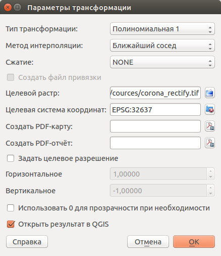
   
   Диалог настроек сохранения результата привязки.

После ввода всех настроек, выполним сохранение растра. Результирующий растр должен
ложиться на растр, который мы использовали в качестве эталона привязки (см. :numref:`ngcourse_rectify_res_pic`).

.. figure:: img/rectify_res.png
   :name: ngcourse_rectify_res_pic
   :align: center
   :width: 10cm
   
   Результат привязки в :program:`NextGIS QGIS`.

.. rubric:: Ссылки

.. [#f1] http://gis-lab.info/qa/landsat-bandcomb.html
.. [#f2] http://gis-lab.info/qa/corona.html

