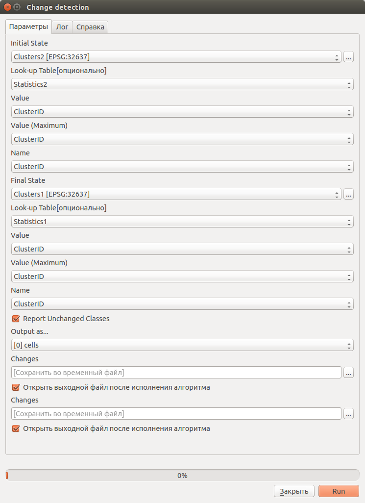
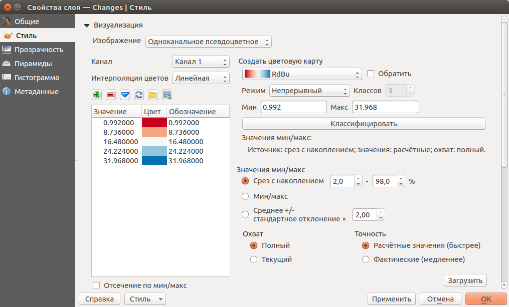

.. sectionauthor:: Дмитрий Барышников <dmitry.baryshnikov@nextgis.ru>

.. _ngcourse_change_detection:

Анализ изменений по разновременным снимкам
==========================================

Анализ изменений представляет собой попиксельное сравнение двух изображений. При 
этом, в зависимости от порога, пиксел относят к тем, что появились, исчезли или
остались неизменными.

Для отработки материала нам необходимы результаты классификации разновременной
съемки, которые были полчены в проессе ваполнения заданий раздела :ref:`ngcourse_classification`.

Для получения карты изменений необходимо использовать инструмент SAGA из панели
анализа данных - **"Change detection"**.
    
Если не открыта панель "Инструменты анализа", идем :menuselection:`Анализ 
данных --> Панель инструментов`. В панели инструментов переходим к пункту 
:menuselection:`SAGA (2.2.0) [235 geoalghorithms] --> Imagery-Classification -->
Change detection`. В открывшемся диалоге (см. :numref:`ngcource_changedetection_pic`) 
указываем исходный классифицированный раст (должна быть доступна статистика растра)
и конечный классифицированный растр. 

   
   Диалог настройки анализа изменений. 
      
Далее нажать кнопку "Run". В результате работы алгоритма должен быть получен 
растр с картой изменений. 

Настроим стиль у полученного растра. Для этого в дереве слоев на полученном растре 
вызовем контекстное меню и выберем в нем пункт "Свойства". В открывшемся диалоге
(см. :numref:`ngcource_change_map_style_pic`) настроим стиль отображения растра.

   
   Диалог настройки стиля растра.  

