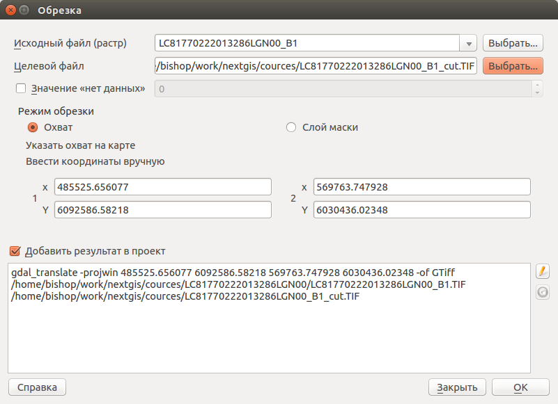
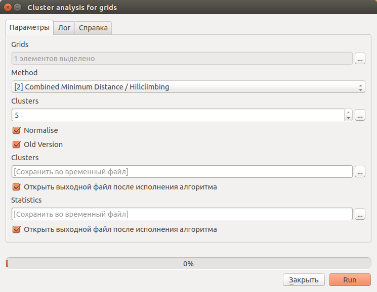

.. sectionauthor:: Дмитрий Барышников <dmitry.baryshnikov@nextgis.ru>

.. _ngcourse_classification:

Классификация снимков
=====================

Существует два типа классификации [#f1]_:
    
    1. Классификация с обучением (группа  методов, в  которых входной  образец 
       путём  сопоставления идентифицируется как член уже определённого класса). 
       К этой группе методов относится дискриминантный анализ, персептрон, 
       нейронные сети и др.
    2. Классификация без обучения (группа методов, в которых входной образец 
       назначается к неизвестному до этого классу). К этой группе методов 
       относятся различные реализации алгоритмов кластеризации.

В случае классификации с обучением, самый простой способ - это выделение эталонов 
в ручном режиме и отнесение их к тому или иному классу. Далее алгоритм выполнит 
поиск по изображению близких по текстуре областей и оконтурит их.

В случае классификации без обучения классификации, алгоритм принимает на вход 
необходимое количество классов и разделяет все изображение на группы с однородной 
текстурой в рамках заданного порога.

Классификация может быть довольно ресурсным процессом. Для ускорения выполнения
заданий возьмем первый канал ранее скачанного снимка с :abbr:`КА (Космического 
аппарата)` Landsat 8 и откроем его в :program:`NextGIS QGIS`. Далее увеличим 
небольшую область снимка и выполним :menuselection:`Растр --> Извлечение --> Обрезка`. 
В открывшемся диалоге (см. :numref:`ngcource_cut_raster_pic`) указываем выходной
файл, на карте рисуем прямоугольник для обрезки.

   
   Диалог обрезки растра.    
    
Далее, если не открыта панель "Инструменты анализа", идем :menuselection:`Анализ 
данных --> Панель инструментов`. В панели инструментов переходим к пункту 
:menuselection:`SAGA (2.2.0) [235 geoalghorithms] --> Imagery-Classification -->
Cluster analysis for grids`. В открывшемся диалоге (см. :numref:`ngcource_cluster_pic) 
указываем один или несколько одноканальных растров, выбираем алгоритм - "Combined Minimum Distance / Hillclimbing", количество кластеров (по-умолчанию стоит 5). 

   
   Диалог настройки классификации. 
      
Далее нажать кнопку "Run". В результате работы алгоритма должен быть получен 
растр с не более пяти градаций яркости. 

Настроим стиль у полученного растра. Для этого в дереве слоев на полученном растре 
вызовем контекстное меню и выберем в нем пункт "Свойства". В открывшемся диалоге
(см. :numref:`ngcource_cluster_raster_style_pic`) настроим стиль отображения растра.

.. figure:: img/cluster_raster_style.png
   :name: ngcource_cluster_raster_style_pic
   :align: center
   :width: 10cm
   
   Диалог настройки стиля растра.  
   
Для выполнения классификации с обучением служит специальный плагин DTClassifier.
Подробнее о плагине см. http://gis-lab.info/qa/dtclassifier.html .
    
.. rubric:: Ссылки

.. [#f1] http://altay-geojournals.ru/wp-content/uploads/2015/02/8-17.pdf

