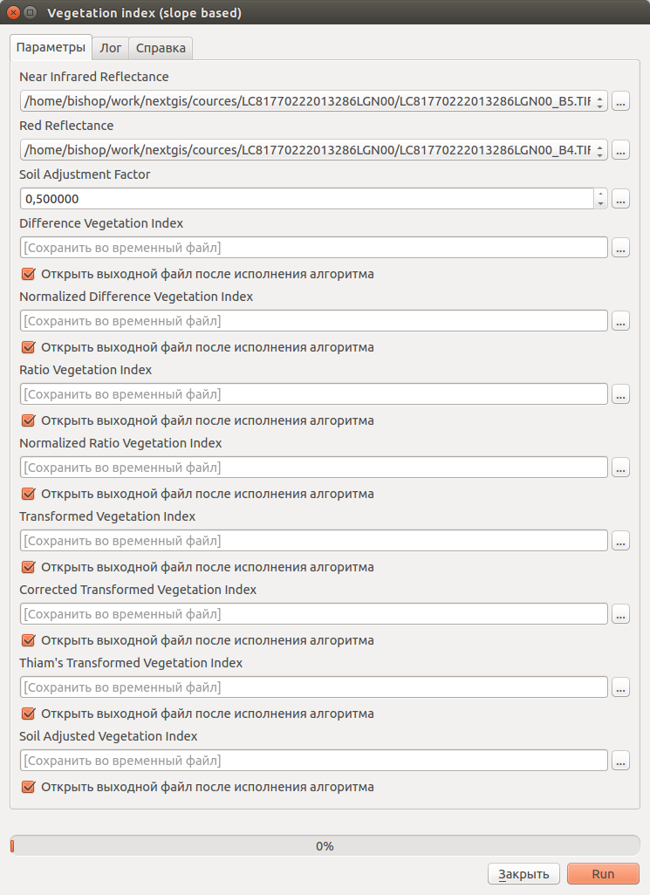
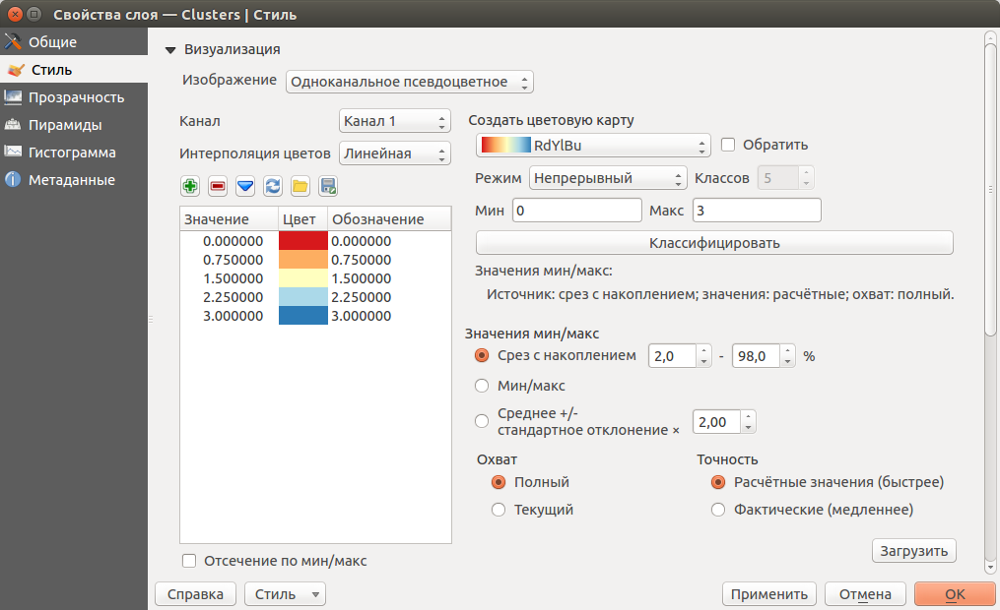
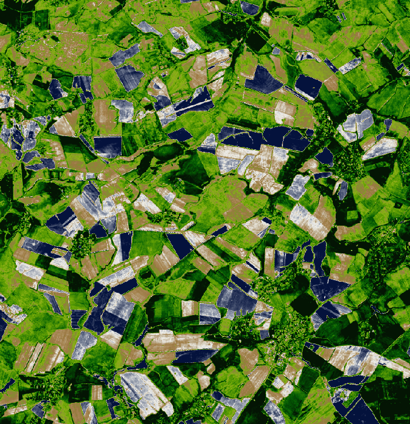
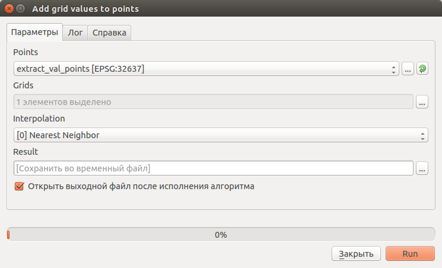

.. sectionauthor:: Дмитрий Барышников <dmitry.baryshnikov@nextgis.ru>

.. _ngcourse_spatial_analysis:
    
Расчеты по снимкам
===================

Расчет вегетационных индексов
-----------------------------

Для расчета вегетационных индексов используются красный и инфракрасный каналы [#f1]_.
Для получения индексов используется инструмент SAGA **"Vegetation index (slope based)"**. Он позволяет рассчитывать:
    
    * Normalized Difference Vegetation Index,
    * Ratio Vegetation Index,
    * Normalized Ratio Vegetation Index,
    * Transformed Vegetation Index,
    * Corrected Transformed Vegetation Index,
    * Thiam's Transformed Vegetation Index,
    * Soil Adjasted Vegetation Index.

Для активации инструмента необходимо открыть панель "Инструменты анализа" 
(:menuselection:`Анализ данных --> Панель инструментов`). В панели инструментов 
перейти к пункту :menuselection:`SAGA (2.2.0) [235 geoalghorithms] --> Imagery-Tools -->
Vegetation index (slope based)`. 
В открывшемся диалоге (см. :numref:`ngcource_ndvi_pic`) 
указываем красный (4) и ИК (5) каналы, отмечаем необходимые индексы. 

   
   Диалог настройки алгоритма расчета индексов. 

В результате работы алгоритма будет получен растр в каждого пикселя которого выполнен
расчет соответствующего индекса. Настроим стиль у полученного растра. Для этого в 
дереве слоев на полученном растре вызовем контекстное меню и выберем в нем пункт
"Свойства". В открывшемся диалоге
(см. :numref:`ngcource_cluster_raster_style1_pic`) настроим стиль отображения растра.

   
   Диалог настройки стиля растра.  
   
В результате применения стиля растр примет следующий вид (см. :numref:`ngcource_ndvi_map_pic`). 

   
   Фрагмент карты.
    
Получение значений растра в точках
----------------------------------    
    
Для получения значений растра в точках необходимо подготовить точечный слой в
той же системе координат, что и растр. Далее активируем инструмент геообработки
в панели инструментов анализа - :menuselection:`SAGA (2.2.0) [235 geoalghorithms] 
--> Shapes-Grid --> Add grid values to points`. В результате откроется диалог
(см. :numref:`ngcource_grid_to_points_pic`).

   
   Диалог извлечения значений растра в точечный слой.

В диалоге необходимо выбрать точечный слой (в слое должна быть хотя бы одна 
точка) и растровый слой (одноканальный растр). 

В результате будет создан новый слой (временный или на диске, в зависимости от
настроек). В слой будет добавлена колонка с именем растра, в которой будут 
извлеченные значения.

.. rubric:: Ссылки

.. [#f1] http://gis-lab.info/qa/ndvi.html
